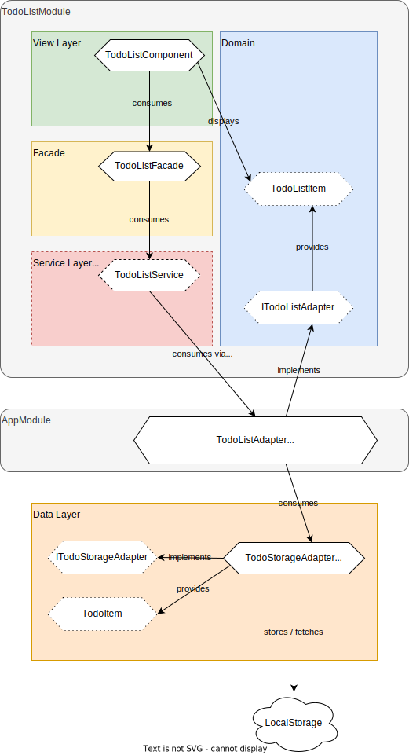

# AngularModularization

Showcase how to modularize angular application by applying a hexagonal architecture and using adapters.

## Overview

## Implementation Details

### Every feature module describes it's interface as an *adapter*

... declaring all internal requirements. This adapter must be implemented and provided by the consumer of the module and allows the module to have it's own domain which is decoupled and unaware of the global / external domain, thus reducing external dependencies to the outside to a bare minimum.

Note: Those adapters should be handed over as `InjectionToken`, since Interfaces can not be used as provides. This allows the Module to not depend on the external implementation as we do not inject the actual implementation directly.

In this example, ...
* `ITodoListAdapter` only knows objects from its own domain (i.e. `TodoListItem`).
* `AppModule` provides a `TodoListAdater` implementing `ITodoListAdpater`.
* `TodoListAdater` takes care of translating data layer models and methods to domain models and methods of the `TodoListModule`.

### The data layer describes a `*StorageAdapter`

... for delcaring an interface for interacting with external sources to read / write data. This separates the concern of where data is coming from and stored at from the rest of the application.

In this example, `AppModule` provides a `TodoStorageAdapterLocalStorage` implementing `ITodoStorageAdapter`, which will read / write data to LocalStorage.

 * `TodoListAdapter` does not inject `TodoStorageAdapterLocalStorage` directly, but uses an injection token. This allows the provider to be easily switched without having to change the `TodoListAdapter` implementation.
 * `TodoStorageAdapterLocalStorage` could easily replaced by a different `*StorageAdapter` consuming REST interface without having to touch other parts of the application.
